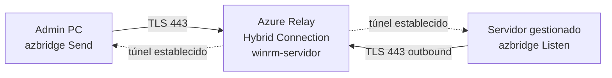
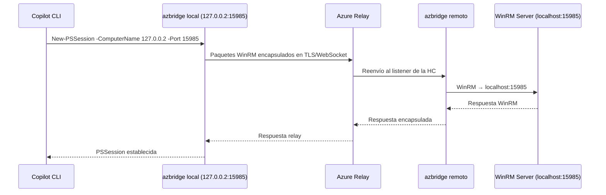

# Administración Remota Windows sin VPN: Arquitecturas Modernas y cómo lo resolvimos con Azure Relay + GitHub Copilot CLI

Cuando necesitas administrar servidores Windows en redes de terceros, o dar acceso remoto a proveedores IT externos sin comprometer la seguridad de tu infraestructura, la respuesta habitual es siempre la misma: VPN. Pero la VPN, bien configurada para empleados internos, genera problemas serios cuando se usa como mecanismo de acceso para proveedores externos. Este artículo analiza las principales arquitecturas disponibles hoy en Azure, cuándo usar cada una, y explica en detalle **Windows Admin Copilot**: un proyecto open source que construimos para resolver este problema de forma pragmática, económica y sin depender de licencias adicionales.

---

## El problema real: acceso de red vs. acceso a recursos

La VPN concede **acceso de red**. Cuando un proveedor IT se conecta a tu VPN, su dispositivo obtiene una dirección IP enrutable en tu red y, salvo que tengas NSGs o ACLs muy bien definidas, puede alcanzar cualquier recurso en ese segmento. El radio de exposición es amplio. La auditoría es difícil de mantener. Y si el dispositivo del proveedor está comprometido, el atacante ha entrado directamente en tu red.

El modelo moderno resuelve esto separando dos conceptos:

- **¿Quién eres?** — autenticación basada en identidad (Entra ID, MFA, Conditional Access)
- **¿A qué accedes?** — acceso a un recurso específico, nunca a una red genérica

Las arquitecturas que analizamos a continuación implementan este principio de formas distintas, con diferentes compromisos entre complejidad, coste y granularidad.

---

## Comparativa de arquitecturas

### 1. VPN Point-to-Site (P2S) con Azure VPN Gateway

La solución clásica. El dispositivo del proveedor instala un cliente VPN, recibe un certificado y obtiene una IP virtual en tu VNet.

```
[Dispositivo Proveedor]
        │
        │  VPN P2S (IKEv2 / OpenVPN)
        ▼
[Azure VPN Gateway]
        │
        │  IP virtual en VNet (10.x.x.x)
        ▼
[VNet — acceso de red genérico]
  ├── Servidor A
  ├── Servidor B
  ├── Base de datos
  └── ... (todo lo que no esté bloqueado por NSG)
```

**Cuándo funciona bien:** equipo IT interno con dispositivos gestionados, Conditional Access aplicado, NSGs bien definidas.

**Problemas con proveedores externos:**
- El proveedor obtiene acceso de red, no acceso a un recurso concreto
- Los dispositivos externos no están bajo tu gestión (sin compliance, sin baselines de seguridad)
- Auditoría: sabes que "el usuario X se conectó a la VPN a las 14:00", pero no qué hizo dentro
- Revocación: requiere gestionar certificados o cuentas, y el acceso puede persistir si no se gestiona activamente
- Cualquier usuario con el fichero de configuración VPN puede conectarse si no tienes controles adicionales

---

### 2. Self-Hosted Agents (Azure DevOps / GitHub Actions)

El proveedor accede exclusivamente al proyecto DevOps o repositorio GitHub. Las acciones se ejecutan a través de pipelines, y el agente que las ejecuta vive **dentro de tu VNet** con Managed Identity y permisos mínimos.

```
[Proveedor]
    │
    │  Acceso al proyecto Azure DevOps / GitHub repo
    ▼
[Pipeline trigger]
    │
    │  Ejecuta en...
    ▼
[Self-hosted Agent VM — dentro de tu VNet]
    │  Managed Identity (RBAC mínimo)
    │
    ├──► Servidor A (deploy)
    ├──► Base de datos (migration)
    └──► Azure Resources (via SDK/ARM)
```

**Ventajas:**
- El proveedor **nunca obtiene conectividad de red**. Solo puede lanzar pipelines
- Auditoría completa en los logs del pipeline, exportable a Sentinel
- Revocación: se elimina del proyecto, acceso cortado inmediatamente
- Scope por pipeline: cada proveedor solo puede ejecutar lo que le corresponde

**Limitaciones:**
- Solo válido para trabajo automatizado (despliegues, mantenimiento programado, CI/CD)
- No sirve para acceso interactivo (explorar un servidor, revisar logs en tiempo real)
- Requiere que el proveedor trabaje en un modelo DevOps

---

### 3. Azure Bastion + Jump Box

Para acceso interactivo sin exponer IPs públicas. El proveedor accede a un servidor de salto (jump box) exclusivamente a través del portal de Azure, usando Azure Bastion.

```
[Proveedor — cuenta B2B de Entra ID]
    │
    │  HTTPS — portal.azure.com
    │  MFA + Conditional Access
    ▼
[Azure Bastion — subred dedicada, sin IP pública]
    │
    │  RDP/SSH proxeado internamente
    ▼
[Jump Box — sin IP pública]
    │
    │  NSGs controlan el alcance
    ▼
[Recursos internos específicos]
```

**Ventajas:**
- Sin IPs públicas en ningún servidor interno
- Acceso B2B con MFA, Conditional Access, cumplimiento de dispositivo
- JIT (Just-in-Time) con Defender for Servers P2: el puerto solo se abre cuando se solicita
- Grabación de sesiones con Bastion Premium
- Revocación: deshabilitar cuenta B2B

**Limitaciones:**
- El proveedor accede al servidor de salto, desde ahí puede alcanzar otros recursos según NSGs
- Requiere una VM dedicada como jump box (coste adicional)
- Para muchos proveedores con recursos distintos, la gestión de alcance puede volverse compleja

---

### 4. ZTNA — Zero Trust Network Access (Microsoft Entra Private Access)

La evolución natural de todo lo anterior. Microsoft incluye desde 2024 una solución nativa de ZTNA en su portfolio **Global Secure Access** (Security Service Edge). El proveedor accede a un recurso específico, no a una red.

```
[Dispositivo Proveedor]
    │  Global Secure Access client
    │
    │  TLS → Microsoft Global Secure Access Edge Nodes
    │
[Microsoft Global Secure Access — Cloud]
    │
    │  → Conector (VM dentro de tu VNet, conexión saliente)
    │
[Conector — dentro de tu VNet]
    │
    │  Accede SOLO al segmento de aplicación definido
    ▼
[Recurso específico: 10.0.1.15:3389]
    (y NADA más)
```

**Punto clave:** el dispositivo del proveedor **no obtiene una IP en tu VNet**. No hay enrutamiento directo. El tráfico es proxeado a nivel de aplicación a través de la infraestructura de Microsoft. Sin lateral movement, sin visibilidad de la red interna.

**Ventajas:**
- Acceso al recurso exacto (IP:puerto o FQDN), no a la subred
- Mismas políticas de Conditional Access, MFA y cumplimiento de dispositivo que el resto de tu entorno
- Auditoría granular por recurso en Entra ID y Microsoft Sentinel
- Revocación inmediata sin gestionar certificados

**Limitaciones:**
- Requiere licenciamiento adicional: Entra ID P1 + addon Global Secure Access / Microsoft Entra Suite
- El cliente Global Secure Access debe instalarse en el dispositivo del proveedor (puede ser fricción en empresas con políticas restrictivas)
- Servicio relativamente reciente, con menos referencias en producción que Bastion o VPN clásica

---

### 5. Azure Relay + azbridge (Windows Admin Copilot)

Este es el enfoque que implementamos en **Windows Admin Copilot**. Arquitectónicamente comparte el mismo principio que ZTNA — conexiones salientes, tráfico relayado, sin puertos entrantes — pero como primitiva de infraestructura de Azure, sin licencias adicionales y con control total del código.

```
[Equipo Admin / Copilot CLI]
    │
    │  WinRM → 127.0.0.2:15985 (loopback local)
    ▼
[azbridge — RelayAdminServer (SYSTEM, Scheduled Task)]
    │  LocalForward: winrm-servidor → 127.0.0.2:15985
    │
    │  TLS/443 → sb://relay-empresa.servicebus.windows.net
    │
[Azure Service Bus Relay — Hybrid Connection: winrm-servidor]
    │
    │  TLS/443 ← (conexión saliente del cliente)
    ▼
[azbridge — RelayClient (SYSTEM, Scheduled Task)]
    │  RemoteForward: RelayName → localhost:15985
    │
    │  WinRM → localhost:15985
    ▼
[Servidor Gestionado — Windows Server]
```

**Principio fundamental:** el servidor gestionado abre una conexión **saliente** a Azure Relay. No existe ningún puerto entrante abierto, ninguna IP pública, ninguna regla de firewall entrante. El admin side también conecta hacia Azure Relay. El tráfico WinRM viaja cifrado dentro del túnel TLS hacia Azure Service Bus y se entrega al servidor de destino.

---

## Comparativa final

| Criterio | VPN P2S | Self-hosted Agents | Azure Bastion | ZTNA (Entra) | **Azure Relay** |
|---|---|---|---|---|---|
| Acceso de red al cliente | Sí (VNet) | No | Parcial (jump box) | No | No |
| Acceso interactivo | Sí | No | Sí | Sí | Sí |
| Acceso automatizado | Sí | Sí | No | Sí | Sí |
| Sin puertos entrantes | No | Sí | Sí (Bastion) | Sí | **Sí** |
| Autenticación Entra ID | Sí | Sí (proyecto) | Sí (B2B) | Sí (nativo) | SAS token |
| MFA / Conditional Access | Sí | Sí | Sí | Sí | No nativo |
| Auditoría nominativa | Sí | Sí | Sí | Sí | Por token |
| Lateral movement posible | Sí | No | Limitado | No | No |
| Coste adicional | VPN GW SKU | Agent VM | Bastion SKU | Licencia Entra Suite | **~$10-35/mes** |
| Complejidad de setup | Media | Media-alta | Media | Alta | **Baja** |
| Funciona con PS7 + script | Sí | No | No | No | **Sí** |
| Ideal para | IT interno | Despliegues DevOps | Soporte interactivo | Acceso granular enterprise | **Admin técnico, MSP** |

---

## Arquitectura profunda de Windows Admin Copilot

### Los dos planos del relay

**Plano de conexión (Azure Service Bus):**



**Plano de datos (WinRM):**



### Modelo de claves SAS

Azure Relay Hybrid Connections usa **Shared Access Signatures (SAS)** para autenticación:

```
Namespace: relay-empresa.servicebus.windows.net
│
├── Regla: send-all-clients  (permiso: Send)
│   └── Usada por: azbridge en el servidor admin (accede a TODAS las HCs)
│
└── HCs:
    ├── winrm-pc-juan
    │   └── Regla: listen-pc-juan  (permiso: Listen)
    │       └── Usada por: azbridge en pc-juan (SOLO esta HC)
    │
    └── winrm-srv-contab
        └── Regla: listen-srv-contab  (permiso: Listen)
            └── Usada por: azbridge en srv-contab (SOLO esta HC)
```

**Principio de mínimo privilegio aplicado:**
- El servidor admin tiene una sola clave con `Send` a nivel namespace. Con ella puede "enviar" a cualquier HC, pero nunca puede escuchar ni actuar como cliente
- Cada servidor gestionado tiene su propia clave `Listen` exclusiva para su HC. Aunque esa clave se filtre, el impacto es mínimo: solo da capacidad de escucha en esa HC concreta, no acceso a ningún recurso

### Topología de puertos y loopback

Cada cliente gestionado tiene asignados de forma única:

| Cliente | HC | Loopback IP | Puerto |
|---|---|---|---|
| pc-juan | winrm-pc-juan | 127.0.0.2 | 15985 |
| srv-contab | winrm-srv-contab | 127.0.0.3 | 15986 |
| srv-sql | winrm-srv-sql | 127.0.0.4 | 15987 |
| ... | ... | 127.0.0.N | 15984+N |

La dirección en el fichero `hosts` del servidor admin mapea el nombre de host a la loopback IP correspondiente, de forma que WinRM puede usar `-Authentication Basic` (el cifrado lo aporta el túnel Azure Relay, no TLS de WinRM).

---

## Quick Start: en marcha en 5 pasos

### Requisitos previos

- Suscripción Azure activa con permisos `Contributor` en el resource group
- Azure CLI instalado (`az login` ejecutado)
- PowerShell 5.0+ en todos los equipos
- Acceso saliente HTTPS/443 desde todos los equipos (admin y gestionados)

### Paso 1 — Crear el namespace Azure Relay (una sola vez)

```powershell
# Clona el repositorio
git clone https://github.com/Alejandrolmeida/windows-admin-copilot.git
cd windows-admin-copilot\setup\agent-vm-client

# Crea el namespace en Azure
.\New-RelayNamespace.ps1 `
    -ResourceGroup "rg-relay" `
    -Namespace     "relay-miempresa" `
    -Location      "westeurope"
```

Genera automáticamente en `.config\`:
- `server-relay.yml` — configuración azbridge del servidor (contiene la SAS key `Send`)
- `server-registry.json` — registro de clientes (inicialmente vacío)

> **Seguridad:** estos ficheros contienen claves SAS. Nunca deben subirse al repositorio. La carpeta `.config\` está en `.gitignore`.

### Paso 2 — Instalar el servidor de administración (una sola vez)

```powershell
# Como Administrador en el equipo admin
.\Install-RelayServer.ps1 -ConfigFile ".\.config\server-relay.yml"
```

Crea la tarea programada `RelayAdminServer` que arranca `azbridge.exe` como `SYSTEM` al iniciar Windows. Con reintentos automáticos (5 intentos, 1 minuto de intervalo) si el proceso cae.

### Paso 3 — Registrar un equipo gestionado

```powershell
# Por cada equipo que quieras gestionar
.\Add-RelayClient.ps1 `
    -ResourceGroup "rg-relay" `
    -Namespace     "relay-miempresa" `
    -MachineName   "servidor-produccion"
```

Este script hace automáticamente:
1. Crea la Hybrid Connection `winrm-servidor-produccion` en Azure
2. Genera `client-servidor-produccion.yml` con la SAS key `Listen` exclusiva
3. Asigna la loopback IP y puerto únicos al cliente
4. Actualiza `server-relay.yml` añadiendo el nuevo `LocalForward`
5. Reinicia `RelayAdminServer` para aplicar los cambios (sin interrumpir el resto de clientes)
6. Añade la entrada en `hosts` del servidor admin

### Paso 4 — Instalar el agente en el equipo gestionado

Copia `client-servidor-produccion.yml` al equipo gestionado (por USB, share de red o `az vm run-command`) y ejecuta:

```powershell
# En el equipo gestionado, como Administrador
.\Register-RelayClient.ps1 -ConfigFile "client-servidor-produccion.yml"
```

El script:
- Descarga `azbridge.exe` desde GitHub Releases (~50 MB) si no está presente
- Configura WinRM en el puerto correcto con autenticación Basic habilitada
- Crea la regla de firewall correspondiente
- Registra la tarea `RelayClient` (SYSTEM, inicio automático)
- Arranca el agente inmediatamente

### Paso 5 — Verificar y conectar

```powershell
# Verificar estado de todos los clientes
.\Get-RelayStatus.ps1

# Conectar a un equipo gestionado
.\Connect-RelaySession.ps1 -MachineName "servidor-produccion" -Username "admin"

# O directamente con PSSession manual
$cred = Get-Credential
$so   = New-PSSessionOption -SkipCACheck -SkipCNCheck
$sess = New-PSSession -ComputerName "servidor-produccion" -Port 15985 `
            -Credential $cred -Authentication Basic -SessionOption $so
Enter-PSSession $sess
```

Salida esperada de `Get-RelayStatus.ps1`:

```
══════════════════════════════════════════════════════
   Azure Relay — Estado de clientes registrados
══════════════════════════════════════════════════════
   2026-04-20 09:00:00

  Namespace   : relay-miempresa
  Servidor    : Tarea 'RelayAdminServer' — Running
  Clientes    : 2 registrados

VM / Cliente          HC                          Loopback IP  Puerto  Tunel TCP    Estado
--------------------  --------------------------  -----------  ------  ---------    ------
servidor-produccion   winrm-servidor-produccion   127.0.0.2    15985   Activo       CONECTADO
workstation-dev       winrm-workstation-dev        127.0.0.3    15986   Activo       CONECTADO
```

---

## Transparencia del código: las partes importantes

### `Add-RelayClient.ps1` — Asignación de puertos y loopback únicos

```powershell
# Calcular puerto local libre (empezando en 15985)
$usedPorts  = @($registry.clients | ForEach-Object { $_.bindPort })
$bindPort   = $BasePort
while ($usedPorts -contains $bindPort) { $bindPort++ }

# Calcular loopback IP única (empezando en 127.0.0.2)
$usedAddresses = @($registry.clients | ForEach-Object { $_.localAddress })
$loopbackIndex = 2
while ($usedAddresses -contains "127.0.0.$loopbackIndex") { $loopbackIndex++ }
$localAddress  = "127.0.0.$loopbackIndex"
```

**Por qué importa:** Windows no puede mapear dos listeners WinRM en el mismo puerto/IP. Usando IPs loopback distintas (127.0.0.2, 127.0.0.3...) podemos tener N clientes en la misma máquina admin sin conflictos, manteniendo un solo proceso azbridge con múltiples `LocalForward`.

### `Add-RelayClient.ps1` — Reconstrucción del YAML del servidor

```powershell
# Reconstruir server-relay.yml con TODOS los clientes actuales
$localForwards = $registry.clients | ForEach-Object {
    "  - RelayName: `"$($_.relayName)`"`n    BindAddress: `"$($_.name)`"`n    BindPort: $($_.bindPort)"
}

$newServerYml = @"
AzureRelayConnectionString: "$connStr"
LocalForward:
$($localForwards -join "`n")
"@
$newServerYml | Set-Content -Path $ServerConfigFile -Encoding UTF8

# Propagar al servidor instalado y reiniciar la tarea
Copy-Item $ServerConfigFile (Join-Path $ServerInstallPath 'azbridge.config.yml') -Force
Stop-ScheduledTask  -TaskName $ServerTaskName
Start-Sleep -Seconds 3
Start-ScheduledTask -TaskName $ServerTaskName
```

**Por qué importa:** añadir un cliente no requiere reinstalar nada. El YAML del servidor se regenera completamente (evitando inconsistencias de edición manual) y la tarea `RelayAdminServer` se reinicia con el nuevo `LocalForward` en cuestión de segundos. Los clientes ya conectados reconectan automáticamente.

### `Register-RelayClient.ps1` — Configuración de WinRM con Basic auth

```powershell
# Habilitar Basic auth y tráfico no cifrado en WinRM
# (el cifrado lo aporta el túnel Azure Relay, no WinRM)
Set-Item WSMan:\localhost\Service\Auth\Basic       $true  -Force
Set-Item WSMan:\localhost\Service\AllowUnencrypted $true  -Force

# Reubicar el listener HTTP al puerto asignado (HostPort del YAML)
if ($currentPort -ne $targetPort) {
    Remove-Item -Path $existingListener.PSPath -Recurse -Force
    New-Item -Path WSMan:\localhost\Listener -Transport HTTP -Address * -Port $targetPort -Force | Out-Null
    Restart-Service WinRM -Force
}
```

**Por qué `AllowUnencrypted = true` no es inseguro aquí:** WinRM por defecto exige HTTPS o NTLM para cifrar el canal. En nuestro caso, el canal WinRM viaja **dentro** del túnel TLS/WebSocket de Azure Relay (TLS 1.2+), que proporciona cifrado end-to-end. Habilitar `AllowUnencrypted` en WinRM solo afecta a las conexiones que lleguen directamente a ese puerto; como ese puerto no es accesible desde el exterior (no hay IP pública, no hay regla de firewall entrante en el firewall perimetral), el riesgo es nulo. La doble capa de cifrado (WinRM HTTPS + TLS relay) añadiría overhead sin beneficio de seguridad real en este modelo.

### `Register-RelayClient.ps1` — Modo CLI vs modo fichero YAML

```powershell
# Preferir modo CLI cuando es posible (más robusto en azbridge v0.16.1)
if ($connStr -and $relayName) {
    # -x <connectionString> -T <relayName>:localhost:<port>
    $taskArgs = "-x `"$connStr`" -T `"${relayName}:localhost:${targetPort}`""
} else {
    # Fallback: usar fichero YAML directamente
    $taskArgs = "-f `"$destConfig`""
}
```

**Por qué importa:** azbridge v0.16.1 tiene un comportamiento sutil con tareas programadas cuando se usa el modo fichero (`-f`): la tarea puede reportar estado `Ready` en lugar de `Running` aunque el proceso esté activo (ya que el proceso hijo no es el proceso de la tarea). El modo CLI (`-x`, `-T`) evita esta ambigüedad porque el proceso principal de azbridge permanece activo como proceso de la tarea.

### `Install-RelayServer.ps1` — Configuración de la tarea como servicio de sistema

```powershell
$settings = New-ScheduledTaskSettingsSet `
    -ExecutionTimeLimit (New-TimeSpan -Seconds 0) `  # Sin límite de tiempo
    -RestartCount 5 `                                 # Reintentos automáticos
    -RestartInterval (New-TimeSpan -Minutes 1) `      # Cada minuto
    -StartWhenAvailable `                             # Arranca si se perdió el trigger
    -MultipleInstances IgnoreNew `                    # No lanzar múltiples instancias
    -AllowStartIfOnBatteries `
    -DontStopIfGoingOnBatteries

$principal = New-ScheduledTaskPrincipal `
    -UserId 'SYSTEM' `
    -LogonType ServiceAccount `
    -RunLevel Highest
```

**Por qué importa:** `ExecutionTimeLimit 0` es crítico. Por defecto, las tareas programadas de Windows se detienen automáticamente después de 72 horas. Un proceso de relay debe correr indefinidamente. `RestartCount 5` con intervalo de 1 minuto asegura resiliencia ante desconexiones transitorias de Azure (que ocurren durante mantenimientos del servicio).

---

## Modelo de seguridad

### Superficie de ataque

| Vector | Estado | Mitigación |
|---|---|---|
| Puertos entrantes en el servidor gestionado | Cerrados | azbridge solo abre conexiones salientes |
| Acceso a la red interna del cliente | No posible | El tráfico es relayado, no enrutado |
| Comprometer clave SAS Send del servidor admin | Alto impacto | Acceso a todas las HCs; rotar con `az relay namespace authorization-rule keys renew` |
| Comprometer clave SAS Listen de un cliente | Bajo impacto | Solo permite escuchar en esa HC concreta; no acceso a ningún recurso |
| Acceso a credenciales WinRM | Medio | Separar credenciales por proveedor; usar cuentas locales dedicadas con permisos mínimos |
| Interceptación del tráfico en Azure | Muy bajo | TLS 1.2+ end-to-end; Azure Service Bus cifrado en tránsito y en reposo |

### Rotación de claves SAS

```powershell
# Rotar la clave del servidor admin (afecta a TODOS los clientes — requiere reinicio de todos los relays)
az relay namespace authorization-rule keys renew `
    --resource-group "rg-relay" `
    --namespace-name "relay-miempresa" `
    --name "send-all-clients" `
    --key PrimaryKey

# Rotar la clave de un cliente específico (solo afecta a ese cliente)
az relay hyco authorization-rule keys renew `
    --resource-group "rg-relay" `
    --namespace-name "relay-miempresa" `
    --hybrid-connection-name "winrm-servidor-produccion" `
    --name "listen-servidor-produccion" `
    --key PrimaryKey
```

### Recomendaciones adicionales

1. **Cuentas WinRM dedicadas por proveedor** — no usar administrador local compartido. Cada proveedor tiene su propia cuenta local con permisos mínimos para su tarea
2. **Logs de conexión** — Azure Monitor puede capturar métricas de actividad del namespace Relay (`ActiveListeners`, `ActiveConnections`, mensajes enviados/recibidos)
3. **Ficheros de configuración** — `server-relay.yml` y `client-*.yml` nunca en repositorios. Usar Azure Key Vault o gestión segreta para distribución en entornos enterprise
4. **Rotación periódica** — planificar rotación de claves SAS de clientes cada 90 días o al finalizar el engagement con un proveedor

---

## La capa de inteligencia: GitHub Copilot CLI

La conectividad es la base. La inteligencia es lo que hace útil esta arquitectura para administración real.

Windows Admin Copilot integra el agente `Windows_Infra_Pro` de GitHub Copilot sobre esta infraestructura. El agente tiene acceso a los servidores gestionados a través del relay y puede:

- Ejecutar diagnósticos de rendimiento, Active Directory, DNS, servicios Windows
- Analizar Event Logs y correlacionar errores
- Gestionar entornos Hyper-V y VMware (via PowerCLI)
- Administrar Microsoft Dynamics NAV, Business Central, AX y F&O
- Interactuar con Azure via MCP (Model Context Protocol) sin cambiar de herramienta
- Solicitar aprobación explícita antes de cualquier operación destructiva

```
[Administrador]
    │  "El servidor de producción está lento desde las 14:00"
    ▼
[GitHub Copilot CLI — agente Windows_Infra_Pro]
    │
    ├── powershell-mcp → Diagnóstico CPU/RAM/disco
    ├── windows-admin-mcp → Event Log últimas 2h
    ├── azure-mcp → Métricas Azure Monitor
    │
    │  [Análisis automático]
    │  "CPU al 95%, proceso sqlservr.exe. 3 queries bloqueantes en sys.dm_exec_requests."
    │
    ├── Hipótesis: bloqueo en SQL Server por query sin índice
    ├── Comando diagnóstico: sp_who2 + sys.dm_exec_sql_text
    └── Solución: KILL session_id (requiere aprobación explícita)
```

El agente implementa metodología **evidence-first**: nunca actúa sin datos, nunca ejecuta operaciones destructivas sin aprobación explícita con análisis de impacto, downtime estimado y plan de rollback.

---

## Costes

### Azure Relay

| Concepto | Precio |
|---|---|
| Namespace | ~$0.10/hora |
| Por Hybrid Connection activa | ~$0.013/hora |
| Transferencia de datos (primer GB gratis) | ~$0.10/GB adicional |

**Estimación práctica:**

| Escenario | Coste mensual estimado |
|---|---|
| 1 servidor, 24/7 | ~$10 |
| 5 servidores, 24/7 | ~$15 |
| 20 servidores, horario laboral | ~$35 |

### Comparativa de coste con alternativas

| Solución | Coste mensual base |
|---|---|
| Azure VPN Gateway (Basic SKU) | ~$27 |
| Azure VPN Gateway (VpnGw1 SKU) | ~$140 |
| Azure Bastion (Basic SKU) | ~$140 |
| Azure Bastion (Standard SKU) | desde ~$190 |
| Entra Private Access (ZTNA) | Entra Suite: ~$12/usuario/mes |
| **Azure Relay (este proyecto)** | **~$10-35/mes total** |

---

## Cuándo usar cada solución

```
¿Necesitas acceso interactivo?
        │
        ├─ NO → ¿Es trabajo automatizado (despliegues, CI/CD)?
        │           ├─ SÍ → Self-hosted Agents (DevOps/GitHub)
        │           └─ NO → Azure Relay + azbridge
        │
        └─ SÍ → ¿El proveedor puede instalar software en su equipo?
                    │
                    ├─ SÍ → ¿Necesitas auditoría nominativa completa con Entra ID?
                    │           ├─ SÍ → ZTNA (Entra Private Access)
                    │           └─ NO → Azure Relay + azbridge
                    │
                    └─ NO → Azure Bastion + Jump Box
```

---

## Conclusión

No existe una única solución correcta para acceso remoto seguro. VPN P2S, Bastion, Agentes self-hosted, ZTNA y Azure Relay son herramientas distintas que resuelven aspectos distintos del mismo problema.

**Windows Admin Copilot** ocupa un espacio específico: acceso técnico, económico, sin puertos entrantes, sin licencias adicionales, con control total del código. Es la solución adecuada cuando necesitas administrar servidores Windows en entornos donde no tienes control del firewall perimetral, donde el coste de una solución enterprise no está justificado, o donde quieres una herramienta que tu equipo entiende y puede mantener.

El código es open source, los scripts están documentados, y la arquitectura se basa en Azure Service Bus Relay, un servicio que Microsoft lleva usando en producción durante más de una década en miles de servicios globales.

---

## Referencias

- [Windows Admin Copilot — GitHub](https://github.com/Alejandrolmeida/windows-admin-copilot)
- [Azure Relay Hybrid Connections Protocol](https://learn.microsoft.com/azure/azure-relay/relay-hybrid-connections-protocol)
- [azbridge — Azure Relay Bridge](https://github.com/Azure/azure-relay-bridge)
- [Microsoft Entra Private Access](https://learn.microsoft.com/entra/global-secure-access/concept-private-access)
- [Azure Bastion documentation](https://learn.microsoft.com/azure/bastion/)
- [Self-hosted agents — Azure Pipelines](https://learn.microsoft.com/azure/devops/pipelines/agents/agents)
- [GitHub Copilot — Agent Mode](https://docs.github.com/copilot/using-github-copilot/using-github-copilot-chat-in-your-ide)
- [Model Context Protocol (MCP)](https://modelcontextprotocol.io/)
